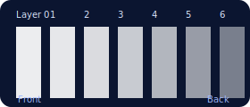
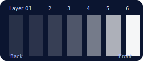

# CloudEngine (package) + Demo App
(https://github.com/jakekinchen/cloud-engine)

This repo contains a Next.js demo and a publishable package `cloud-engine` that provides:
- React component: `CloudMaker`
- Headless engine: `createCloudEngine`
- Helper: `renderSvg`

## Screenshots


## Opacity ramp tuning

As of this release the engine generates a back-to-front opacity ramp: the furthest layer starts near 12% opacity and the foremost layer eases in to roughly 96% opacity. This creates a much denser leading edge, which is especially helpful when using additive blending.

| Previous default | New default |
| --- | --- |
|  |  |

- `CloudMaker` and `createCloudEngine` now expose `backOpacity`, `frontOpacity`, and `opacityCurvePower` props so you can dial the ramp without providing a full `layerOpacities` array.
- Explicit `layerOpacities` arrays still win whenever they are provided, so existing custom setups keep their exact look.
- With additive blending (`additiveBlending={true}` / `additiveBlending: true`) the foremost layer now resolves with a visibly solid opacity while the background layers stay airy.

Examples:

```tsx
<CloudMaker additiveBlending backOpacity={0.1} frontOpacity={0.98} opacityCurvePower={3} />
```

```ts
renderSvg({ layers: 7, backOpacity: 0.08, frontOpacity: 0.95, opacityCurvePower: 2.8 });
```

When you need full control, pass your own `layerOpacities` array. The helper curve is only applied when no per-layer values are supplied.

## Package usage (React)

```tsx
import { CloudMaker } from 'cloud-engine';

export default function Hero() {
  return (
    <div style={{ width: '100%', height: 380 }}>
      <CloudMaker
        width={1200}
        height={380}
        layers={7}
        style={{ width: '100%', height: '100%' }}
        fit="stretch"
        background={false}
      />
    </div>
  );
}
```

## Package usage (Headless)

```ts
import { renderSvg } from 'cloud-engine';

const svg = renderSvg({ width: 1200, height: 380, layers: 7, seed: 1337 });
```

## Develop the demo

```bash
npm install
npm run dev
```

Open http://localhost:3000 to view.

## Build and publish the package

```bash
cd portable-package
npm run build
# optional version bump
npm version patch
npm publish --access public
```
