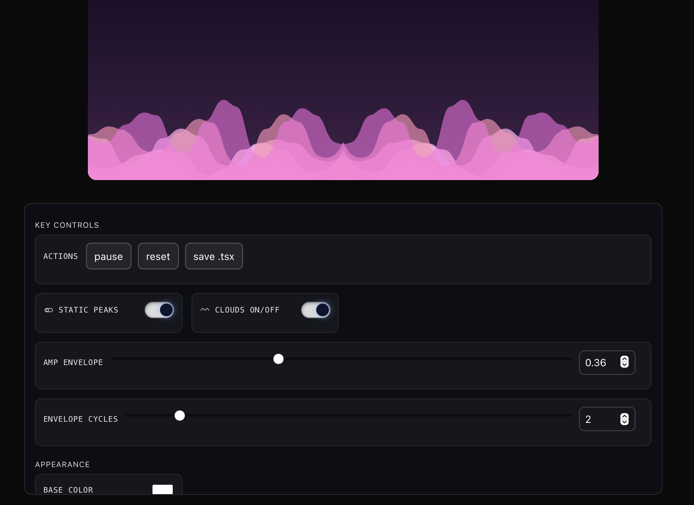
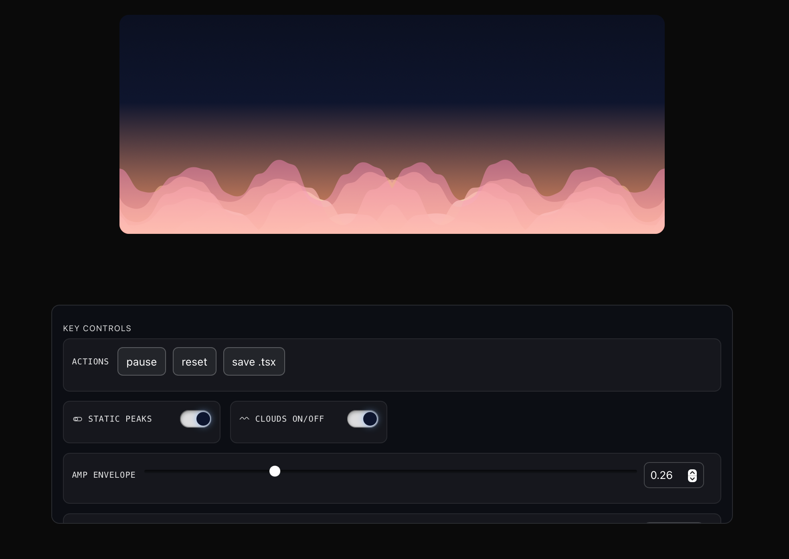
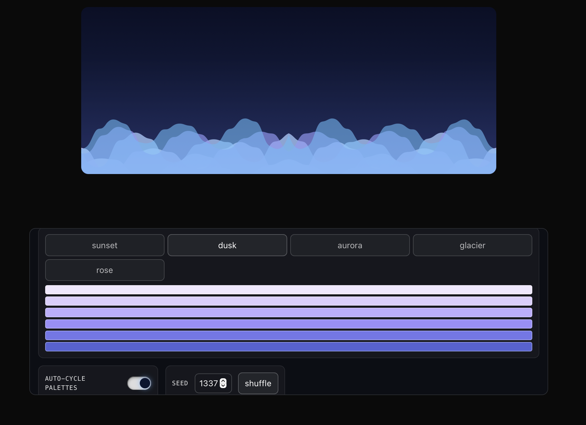

# CloudEngine (package) + Demo App

This repo contains a Next.js demo and a publishable package `cloud-engine` that provides:
- React component: `CloudMaker`
- Headless engine: `createCloudEngine`
- Helper: `renderSvg`

## Screenshots





## Package usage (React)

```tsx
import { CloudMaker } from 'cloud-engine';

export default function Hero() {
  return (
    <div style={{ width: '100%', height: 380 }}>
      <CloudMaker
        width={1200}
        height={380}
        layers={7}
        style={{ width: '100%', height: '100%' }}
        fit="stretch"
        background={false}
      />
    </div>
  );
}
```

## Package usage (Headless)

```ts
import { renderSvg } from 'cloud-engine';

const svg = renderSvg({ width: 1200, height: 380, layers: 7, seed: 1337 });
```

## Develop the demo

```bash
npm install
npm run dev
```

Open http://localhost:3000 to view.

## Build and publish the package

```bash
cd portable-package
npm run build
# optional version bump
npm version patch
npm publish --access public
```
