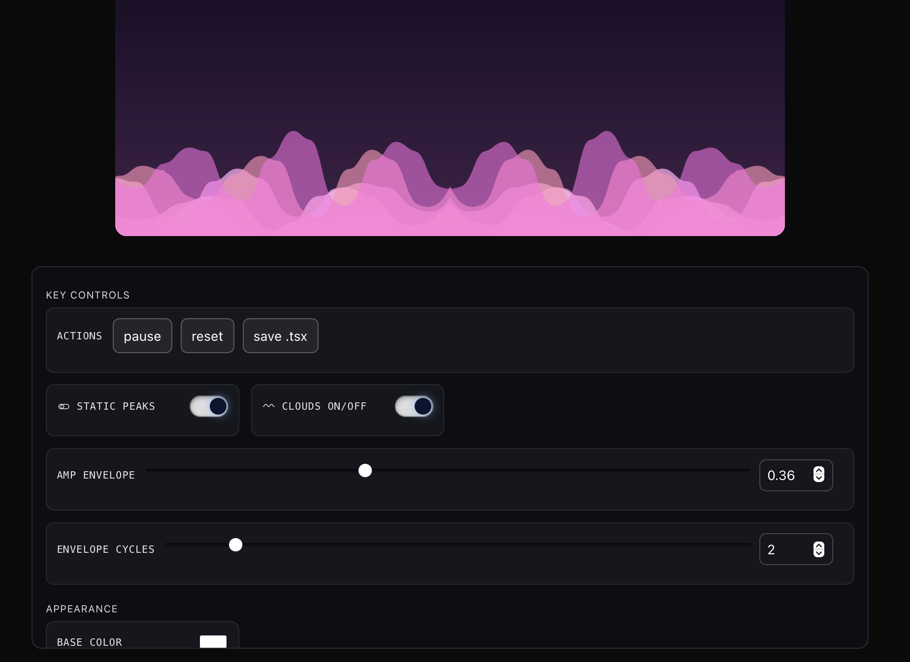
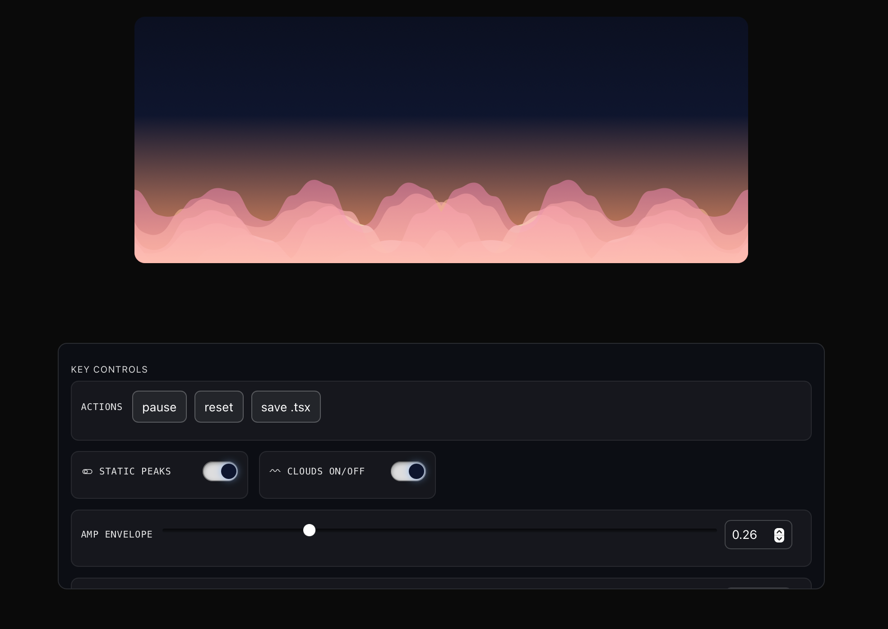
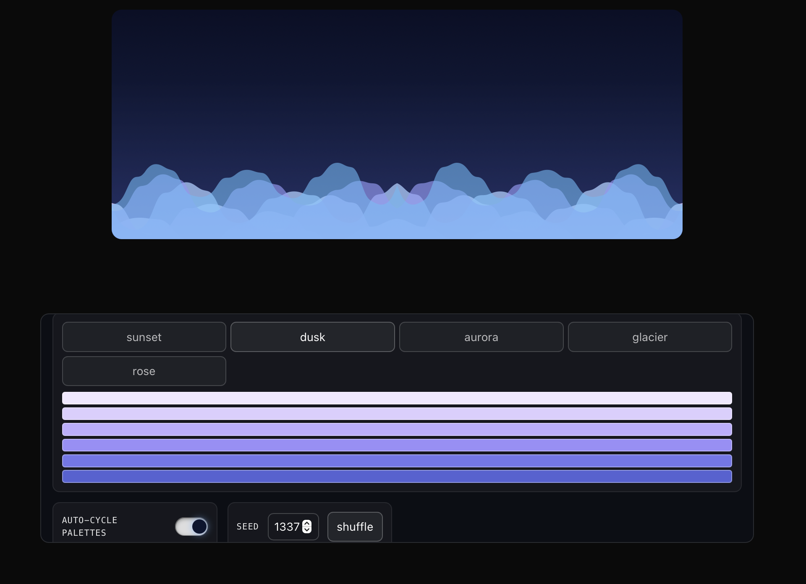

# CloudEngine

Headless engine and React component for layered cloud SVG waves.

- React component: `CloudMaker`
- Headless functions: `createCloudEngine`, `renderSvg`

## Screenshots





## Install

```bash
npm install cloud-engine
```

## React usage

```tsx
import { CloudMaker } from 'cloud-engine';

export default function Hero() {
  return (
    <div style={{ width: '100%', height: 380 }}>
      <CloudMaker
        width={1200}
        height={380}
        layers={7}
        // Make it edge-to-edge inside any container
        style={{ width: '100%', height: '100%' }}
        fit="stretch"           // 'stretch' | 'meet' | 'slice'
        background={false}       // default is false in this package; pass a color for a solid bg
        seamlessLoop
      />
    </div>
  );
}
```

- `animate` (default true) can be disabled to render a static frame.
- When `animate={false}`, pass `phase`, `morphT`, `cycleIndex` to control the frame.
- `fit` controls how the SVG scales within its box.
- `background` can be `false` (transparent, default in this package) or a solid color string.
- `seamlessLoop` ensures morph fields don’t reseed each cycle (default true).
- Use `style={{ width: '100%', height: '100%' }}` and a parent with your desired size for corner-to-corner fill.

## Headless usage

```ts
import { renderSvg } from 'cloud-engine';

const svg = renderSvg({ width: 1200, height: 380, layers: 7, seed: 1337 });
```

## API
- `CloudMaker` props mirror engine config plus layout helpers:
  - `animate`, `phase`, `morphT`, `cycleIndex`, `className`, `style`, `fit`, `background`, `seamlessLoop`
- `createCloudEngine(config)` → `{ pathsAt, svgAt, width, height, blur, config }`
- `renderSvg(config, { phase, morphT, cycleIndex })` → string

### Defaults (match showcased app reset)
```ts
{
  width: 1200,
  height: 380,
  layers: 7,
  segments: 450,
  baseColor: '#ffffff',
  seed: 1337,
  blur: 2.2,
  waveForm: 'sincos',
  noiseSmoothness: 0.45,
  amplitudeJitter: 0,
  amplitudeJitterScale: 0.25,
  curveType: 'spline',
  curveTension: 0.85,
  peakStability: 1,
  peakNoiseDamping: 1,
  peakNoisePower: 4,
  peakHarmonicDamping: 1,
  useSharedBaseline: true,
  morphStrength: 0,
  morphPeriodSec: 18,
  amplitudeEnvelopeStrength: 0.7,
  amplitudeEnvelopeCycles: 10,
  peakRoundness: 0.8,
  peakRoundnessPower: 10,
  seamlessLoop: true,
  background: false,
}
```

## Solid background

Provide an HSL or hex color to enable the solid background inside the SVG:

```tsx
<CloudMaker background="hsl(210deg 60% 12%)" />
<CloudMaker background="#0b1530" />
```

## Seamless morph loop

Morphing uses a cosine window and fixed fields when `seamlessLoop` is true, producing a clean loop with no reseed seam:

```tsx
<CloudMaker morphStrength={0.35} morphPeriodSec={18} seamlessLoop />
```

## Contributing & Publishing
- Build: `npm run build`
- Version: `npm version patch|minor|major`
- Publish: `npm publish --access public`

## License
MIT
